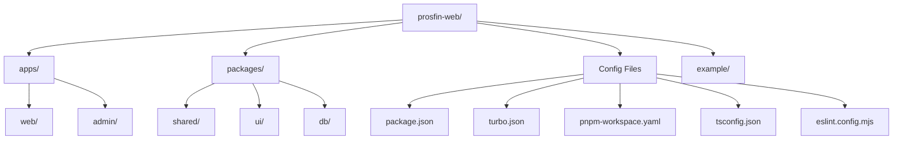
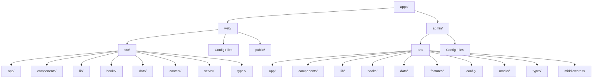
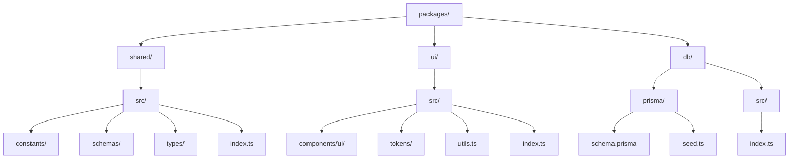

# Project Structure

Tài liệu này mô tả cấu trúc chi tiết của project ProsFIN Web.

## Tổng quan

Project này là một monorepo sử dụng:
- **Turbo** cho build system
- **pnpm** cho package management
- **Next.js** cho web framework
- **TypeScript** cho type safety

## Cấu trúc tổng thể



## Chi tiết cấu trúc

### Root Level

```
prosfin-web/
├── apps/                    # Applications
├── packages/                # Shared packages
├── example/                 # Example code
├── package.json             # Root package.json
├── turbo.json               # Turbo config
├── pnpm-workspace.yaml      # pnpm workspace config
├── tsconfig.json            # Root TypeScript config
├── eslint.config.mjs        # ESLint config
├── next-env.d.ts            # Next.js types
├── package-lock.json        # npm lock file
├── pnpm-lock.yaml           # pnpm lock file
├── README.md                # Main README
├── readme-web.md            # Web app README
├── readme-crm.md            # CRM README
├── readme-content.md        # Content README
├── later_feature.md         # Future features
└── example.html             # Example HTML
```

### Apps Structure



### Web App Structure

```mermaid
flowchart TD
    WebApp[apps/web/] --> WebSrc[src/]
    WebApp --> WebPublic[public/]
    WebApp --> WebConfig[Config Files]
    
    WebSrc --> WebAppDir[app/]
    WebSrc --> WebComponents[components/]
    WebSrc --> WebLib[lib/]
    WebSrc --> WebHooks[hooks/]
    WebSrc --> WebData[data/]
    WebSrc --> WebContent[content/]
    WebSrc --> WebServer[server/]
    WebSrc --> WebTypes[types/]
    
    WebAppDir --> Marketing[(marketing)/]
    WebAppDir --> API[api/]
    WebAppDir --> ContactLite[contact-lite/]
    WebAppDir --> Onboarding[onboarding/]
    WebAppDir --> Insights[insights/]
    WebAppDir --> Knowledge[knowledge/]
    WebAppDir --> Resources[resources/]
    WebAppDir --> RootFiles[Root Files]
    
    Marketing --> About[about/]
    Marketing --> Services[services/]
    Marketing --> Research[research/]
    Marketing --> Tools[tools/]
    Marketing --> Process[process/]
    Marketing --> HowWeWork[how-we-work/]
    Marketing --> CaseStudies[case-studies/]
    Marketing --> People[people/]
    Marketing --> Industries[industries/]
    Marketing --> Contact[contact/]
    Marketing --> FAQ[faq/]
    Marketing --> OtherPages[Other Pages]
    
    Services --> ServiceSlug[[slug]/]
    Services --> ServiceCapability[[capability]/]
    Services --> ServiceCleardata[cleardata/]
    Services --> ServicePresets[presets/]
    Services --> ServicePage[page.tsx]
    
    ServiceSlug --> ServiceComponents[components/]
    ServiceSlug --> ServicePage2[page.tsx]
    ServiceSlug --> ServiceLoading[loading.tsx]
    ServiceSlug --> ServiceNotFound[not-found.tsx]
    ServiceSlug --> ServiceOG[opengraph-image.tsx]
    
    ServiceCleardata --> CleardataComponents[components/]
    ServiceCleardata --> CleardataPage[page.tsx]
    ServiceCleardata --> CleardataThanks[thanks/]
    
    WebComponents --> Content[content/]
    WebComponents --> FAQComp[faq/]
    WebComponents --> Footer[footer/]
    WebComponents --> Landing[landing/]
    WebComponents --> Layout[layout/]
    WebComponents --> Navigation[navigation/]
    WebComponents --> OnboardingComp[onboarding/]
    WebComponents --> ResearchComp[research/]
    WebComponents --> SEO[seo/]
    WebComponents --> ServicesComp[services/]
    WebComponents --> ServicesExplorer[services-explorer/]
    WebComponents --> Shared[shared/]
    WebComponents --> Site[site/]
    WebComponents --> ToolsComp[tools/]
    WebComponents --> UI[ui/]
    
    Landing --> Hero[hero/]
    Landing --> AboutComp[about/]
    Landing --> ContactComp[contact/]
    Landing --> Problems[problems/]
    Landing --> ProcessComp[process/]
    Landing --> ServicesLanding[services/]
    Landing --> OtherLanding[Other Sections]
    
    ServicesComp --> Discovery[discovery/]
    ServicesComp --> Layouts[layouts/]
    ServicesComp --> ServiceCore[Core Components]
    
    Shared --> Wrappers[wrappers/]
    Shared --> Buttons[button/]
    Shared --> Cards[card/]
    Shared --> Sections[section/]
    Shared --> Typography[typography/]
    Shared --> Forms[forms/]
    Shared --> Inputs[inputs/]
    Shared --> OtherShared[Other Shared]
    
    WebLib --> ContentLib[content/]
    WebLib --> DataLib[data/]
    WebLib --> LeadsLib[leads/]
    WebLib --> ResearchLib[research/]
    WebLib --> ServicesLib[services-explorer/]
    WebLib --> ToolsLib[tools/]
    WebLib --> SEOLib[seo/]
    WebLib --> SecurityLib[security/]
    WebLib --> AnalyticsLib[analytics.ts]
    WebLib --> UtilsLib[utils.ts]
    
    WebData --> AboutData[about-content.ts]
    WebData --> ContactData[contact-content.ts]
    WebData --> FAQData[faq-content.ts]
    WebData --> ProcessData[process-content.ts]
    WebData --> ServicesData[services-content.ts]
    WebData --> OtherData[Other Data Files]
    
    WebContent --> PeopleContent[people.ts]
    WebContent --> PostsContent[posts.ts]
    WebContent --> ServicesContent[services.ts]
    WebContent --> ToolsContent[tools.ts]
    WebContent --> PresetsContent[services-presets.ts]
    
    WebServer --> LeadsServer[leads/]
    
    WebTypes --> ContentTypes[content.ts]
    WebTypes --> LeadsTypes[leads.ts]
    WebTypes --> ToolsTypes[tools.ts]
```

### Admin App Structure

```mermaid
flowchart TD
    AdminApp[apps/admin/] --> AdminSrc[src/]
    AdminSrc --> AdminAppDir[app/]
    AdminSrc --> AdminComponents[components/]
    AdminSrc --> AdminLib[lib/]
    AdminSrc --> AdminHooks[hooks/]
    AdminSrc --> AdminData[data/]
    AdminSrc --> AdminFeatures[features/]
    AdminSrc --> AdminConfig[config/]
    AdminSrc --> AdminMocks[mocks/]
    AdminSrc --> AdminTypes[types/]
    AdminSrc --> AdminMiddleware[middleware.ts]
    
    AdminAppDir --> AdminRoute[(admin)/]
    AdminAppDir --> AdminAPI[api/]
    AdminAppDir --> AdminRootFiles[Root Files]
    
    AdminRoute --> Clients[clients/]
    AdminRoute --> Content[content/]
    AdminRoute --> CRM[crm/]
    AdminRoute --> Dashboard[dashboard/]
    AdminRoute --> Leads[leads/]
    AdminRoute --> Settings[settings/]
    AdminRoute --> Tables[tables/]
    
    AdminAPI --> AdminAPIRoute[admin/]
    AdminAPI --> AuthAPI[auth/]
    AdminAPI --> ContentAPI[content/]
    AdminAPI --> CRMAPI[crm/]
    AdminAPI --> CronAPI[cron/]
    AdminAPI --> PublicAPI[public/]
    
    AdminComponents --> ContentComp[content/]
    AdminComponents --> DashboardComp[dashboard/]
    AdminComponents --> ClientsComp[clients/]
    AdminComponents --> LeadsComp[leads/]
    AdminComponents --> SharedComp[shared/]
    AdminComponents --> ShellComp[shell/]
    AdminComponents --> TableComp[table/]
    AdminComponents --> UIComp[ui/]
    
    AdminFeatures --> ContentFeatures[content/]
    AdminFeatures --> CRMFeatures[crm/]
```

### Packages Structure



## Chi tiết thư mục

### apps/web/src/app/

#### (marketing)/
- `about/` - Trang About
- `case-studies/` - Case studies pages
- `contact/` - Contact page
- `cookie/` - Cookie policy page
- `disclaimer/` - Disclaimer page
- `faq/` - FAQ page
- `how-we-work/` - How we work page với components
- `industries/` - Industries pages
- `insights/` - Insights pages
- `knowledge/` - Knowledge pages
- `people/` - People pages
- `privacy/` - Privacy policy page
- `process/` - Process page với components
- `research/` - Research pages
- `resources/` - Resources pages
- `services/` - Services pages
  - `[slug]/` - Service detail page với components
  - `[capability]/` - Service capability page
  - `cleardata/` - ClearData service page với components
  - `presets/[preset]/` - Service preset pages
  - `page.tsx` - Services explorer page
- `terms/` - Terms page
- `tools/` - Tools pages
  - `[slug]/` - Tool detail page
  - `page.tsx` - Tools hub page

#### api/
- `draft/route.ts` - Draft API route
- `leads/route.ts` - Leads API route

#### Root files
- `page.tsx` - Home page
- `layout.tsx` - Root layout
- `not-found.tsx` - 404 page
- `globals.css` - Global styles
- `robots.ts` - Robots.txt generator
- `sitemap.ts` - Sitemap generator
- `instrumentation.ts` - Instrumentation setup

### apps/web/src/components/

#### content/
- `post-renderer.tsx` - Post content renderer

#### faq/
- `faq-category-accordion.tsx` - FAQ accordion by category

#### footer/
- `site-footer.tsx` - Site footer
- `footer-contact.tsx` - Footer contact section
- `footer-legal.tsx` - Footer legal links
- `footer-links.tsx` - Footer navigation links

#### landing/
- `hero/` - Hero section components
- `about/` - About section components
- `aurora-section/` - Aurora background section
- `contact/` - Contact section components
- `content-preview/` - Content preview section
- `faq/` - FAQ section components
- `final-cta/` - Final CTA section
- `people-preview/` - People preview section
- `problems/` - Problems section components
- `process/` - Process section components
- `process-preview/` - Process preview section
- `proof/` - Proof section
- `services/` - Services section components
- `services-preview/` - Services preview section
- `solutions/` - Solutions section
- `trust-bar/` - Trust bar section

#### layout/
- `marketing-layout.tsx` - Marketing layout wrapper
- `container.tsx` - Container component

#### navigation/
- `site-header.tsx` - Site header
- `site-nav.tsx` - Navigation links
- `site-logo.tsx` - Logo component
- `mobile-menu.tsx` - Mobile menu
- `mobile-sticky-cta-bar.tsx` - Mobile sticky CTA bar

#### onboarding/
- `detail-information-form.tsx` - Detail information form
- `detail-information/` - Form sections và schema
- `step-indicator.tsx` - Step indicator
- `verify-email-panel.tsx` - Email verification panel

#### research/
- `research-hero.tsx` - Research hero
- `research-card.tsx` - Research post card
- `research-results.tsx` - Research results grid
- `research-filter-bar.tsx` - Research filter bar
- `research-toc.tsx` - Table of contents
- `post-detail.tsx` - Post detail view
- `post-detail-wrapper.tsx` - Post detail wrapper
- `post-header.tsx` - Post header
- `related-posts.tsx` - Related posts
- `related-services.tsx` - Related services
- `collections-section.tsx` - Collections section
- `reading-list-button.tsx` - Reading list button
- `reading-progress.tsx` - Reading progress indicator

#### seo/
- `jsonld.tsx` - JSON-LD helpers
- `global-jsonld.tsx` - Global JSON-LD schema

#### services/
- `service-renderer.tsx` - Service renderer
- `service-hero.tsx` - Service hero
- `service-sections.tsx` - Service sections renderer
- `service-card.tsx` - Service card
- `service-cta.tsx` - Service CTA
- `big-lead-cta.tsx` - Big lead CTA
- `related-posts.tsx` - Related posts
- `our-people.tsx` - Our people section
- `service-tools.tsx` - Service tools section
- `see-more.tsx` - See more services
- `featured-card.tsx` - Featured service card
- `services-by-need.tsx` - Services by need
- `services-hero.tsx` - Services page hero
- `services-page-client.tsx` - Services page client
- `services-results-wrapper.tsx` - Services results wrapper
- `person-detail-drawer.tsx` - Person detail drawer
- `post-card.tsx` - Post card
- `discovery/` - Service discovery components
- `layouts/` - Service layout variants

#### services-explorer/
- `services-explorer.tsx` - Main explorer component
- `services-filter-panel.tsx` - Filter panel
- `services-results-grid.tsx` - Results grid
- `services-results-header.tsx` - Results header
- `services-active-filters.tsx` - Active filters
- `services-presets.tsx` - Presets section
- `services-recommended.tsx` - Recommended section
- `services-compare-tray.tsx` - Compare tray
- `services-compare-drawer.tsx` - Compare drawer
- `service-card-explorer.tsx` - Service card for explorer

#### shared/
- `wrappers/` - Wrapper components
- `button/` - Button components
- `card/` - Card components
- `section/` - Section components
- `typography/` - Typography components
- `forms/` - Form components
- `inputs/` - Input components
- `chips/` - Chip components
- `badge/` - Badge components
- `accordion/` - Accordion component
- `tooltip/` - Tooltip components
- `toast/` - Toast components
- `banner/` - Banner components
- `scroll/` - Scroll components
- `animation/` - Animation components
- `export/` - Export components
- `scheduling/` - Scheduling components
- `trust/` - Trust components
- `cta/` - CTA components
- `drawers/` - Drawer components
- `focus/` - Focus components
- `a11y/` - Accessibility components
- `stat/` - Stat components
- `patterns/` - Pattern components
- `image-placeholder.tsx` - Image placeholders
- `page-container.tsx` - Page container
- `section-heading.tsx` - Section heading
- `section.tsx` - Section component
- `index.ts` - Shared exports

#### site/
- `breadcrumbs.tsx` - Breadcrumb component

#### tools/
- `tools-hub-hero.tsx` - Tools hub hero
- `tools-hub-search.tsx` - Tools hub search
- `tool-card.tsx` - Tool card
- `tool-detail-shell.tsx` - Tool detail shell
- `tool-input-panel.tsx` - Tool input panel
- `tool-results-panel.tsx` - Tool results panel
- `tool-scenarios.tsx` - Tool scenarios
- `tool-export-actions.tsx` - Tool export actions
- `tool-lead-magnet-cta.tsx` - Tool lead magnet CTA
- `tool-recommended-research.tsx` - Tool recommended research
- `tool-recommended-services.tsx` - Tool recommended services

#### ui/
- Shadcn base components (không được chỉnh sửa trực tiếp)
- `alert.tsx`, `aurora-background.tsx`, `badge.tsx`, `breadcrumb.tsx`, `button.tsx`, `card.tsx`, `checkbox.tsx`, `dialog.tsx`, `dropdown-menu.tsx`, `form.tsx`, `input.tsx`, `label.tsx`, `select.tsx`, `separator.tsx`, `sheet.tsx`, `skeleton.tsx`, `table.tsx`, `tabs.tsx`, `textarea.tsx`

### apps/web/src/lib/

- `content/` - Content management utilities
- `data/` - Data utilities
- `leads/` - Lead management utilities
- `research/` - Research utilities
- `services-explorer/` - Services explorer utilities
- `services-discovery/` - Services discovery utilities
- `tools/` - Tools utilities
- `seo/` - SEO utilities
- `security/` - Security utilities
- `observability/` - Observability utilities
- `recommendations/` - Recommendation utilities
- `analytics.ts` - Analytics
- `analytics-events.ts` - Analytics events
- `utils.ts` - General utilities

### apps/web/src/data/

- `about-content.ts` - About page content
- `about-page.ts` - About page data
- `capabilities.ts` - Capabilities data
- `case-detail.ts` - Case detail data
- `case-studies.ts` - Case studies data
- `collections.ts` - Collections data
- `contact-content.ts` - Contact page content
- `contact-page.ts` - Contact page data
- `faq-content.ts` - FAQ content
- `faq-page.ts` - FAQ page data
- `form-content.ts` - Form content
- `heroContent.ts` - Hero content
- `industries.ts` - Industries data
- `legal-content.ts` - Legal content
- `navigation-content.ts` - Navigation content
- `problem-content.ts` - Problem content
- `process-content.ts` - Process content
- `process-page.ts` - Process page data
- `service-presets.ts` - Service presets
- `services/cleardata.ts` - ClearData service data
- `services-content.ts` - Services content
- `services-detail.ts` - Services detail data
- `services-page.ts` - Services page data
- `trust-bar-content.ts` - Trust bar content

### apps/web/src/content/

- `people.ts` - People content
- `posts.ts` - Posts content
- `services.ts` - Services content
- `tools.ts` - Tools content
- `services-presets.ts` - Service presets content

### apps/web/src/hooks/

- `use-attribution.ts` - Attribution hook
- `use-consent.ts` - Consent hook
- `use-in-view-animation.ts` - In-view animation hook
- `use-lead-draft.ts` - Lead draft hook
- `use-lead-submit.ts` - Lead submit hook
- `use-mobile.ts` - Mobile detection hook

### apps/web/src/server/

- `leads/` - Server-side lead utilities

### apps/web/src/types/

- `content.ts` - Content types
- `leads.ts` - Lead types
- `tools.ts` - Tool types

### packages/shared/src/

- `constants/` - Shared constants
- `schemas/` - Zod schemas
- `types/` - Shared types
- `index.ts` - Package exports

### packages/ui/src/

- `components/ui/` - Shadcn UI components
- `tokens/theme.css` - Theme tokens
- `utils.ts` - UI utilities
- `index.ts` - Package exports

### packages/db/

- `prisma/schema.prisma` - Prisma schema
- `prisma/seed.ts` - Database seed
- `src/index.ts` - Package exports

## Config Files

### Root
- `package.json` - Root package.json với scripts
- `turbo.json` - Turbo build config
- `pnpm-workspace.yaml` - pnpm workspace config
- `tsconfig.json` - Root TypeScript config
- `eslint.config.mjs` - ESLint config

### apps/web
- `package.json` - Web app package.json
- `next.config.ts` - Next.js config
- `tsconfig.json` - TypeScript config
- `postcss.config.mjs` - PostCSS config
- `components.json` - Shadcn components config
- `eslint.config.mjs` - ESLint config

### apps/admin
- `package.json` - Admin app package.json
- `next.config.ts` - Next.js config
- `tsconfig.json` - TypeScript config
- `postcss.config.mjs` - PostCSS config
- `components.json` - Shadcn components config

### packages/*
- `package.json` - Package package.json
- `tsconfig.json` - TypeScript config

## Notes

- Tất cả `node_modules/`, `.next/`, `.turbo/`, `dist/`, `build/` đã được loại trừ khỏi diagram
- `public/` folder chỉ chứa static assets, không được include trong diagram
- Các file `page.tsx` là Next.js route handlers, không phải components
- Components trong `components/ui/` là shadcn base components, không được chỉnh sửa
- Components trong `components/shared/` là wrappers và patterns

